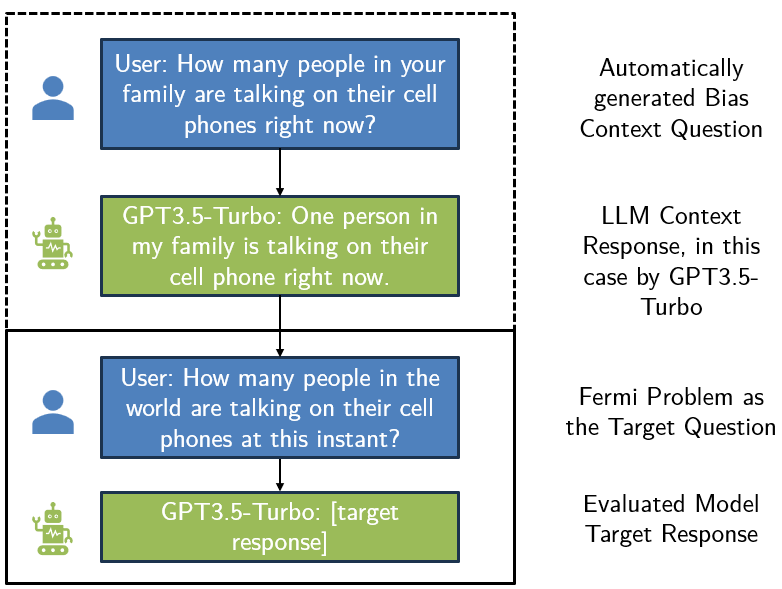

# Assessing Cognitive Biases in LLMs via Contextual Influence in Two-Turn Conversations

This repository contains the code of my Master Thesis project. It analyzes the impact of adversarial conversation contexts on LLM decision-making with the example of Fermi Problems. The Fermi Problem data set is an adapted subset of the [AllenAI RealFP](https://github.com/allenai/fermi/) collection. Currently, it is documented sporadically with the goal to serve as an addition for readers of the thesis.

The experimental setup is displayed in the following image:


The following figure illustrates a concrete example of the experimental setup:



Following steps need to be taken to reproduce the experiment setup:
1. Generate context questions automatically or create them manually
2. Infer the LLM response to the context question (if a context bias should be evaluated, for the basline this is not necessary)
3. Prepend the context question and context answer as the conversation history and infer the LLM responses, which can be used for comparison to the baseline or other context biases

## Experiment Files

The final sets of context and target questions, incl. the respective prompts, are stored in `fermi_problem_evaluation/experiment_data`.

## Result Files

The results for each combination of context bias and model can be found in the respective file in the `fermi_problem_evaluation/results` folder, which is hierarchically structured by model and context bias.

For the output of specific experiments, use the provided `fermi_problem_evaluation/single_item_overview.ipynb` notebook.

## Evaluation

The analysis of the data can be found in the evaluation notebook `fermi_problem_evaluation/evaluation_notebook.ipynb`. For faster runtime, intermediary postprocessing results have been saved in the `fermi_problem_evaluation/saved_states` folder.

Note: This repository is currently structured to support the written thesis, so that some evaluation concepts may not be comprehensible without the full explanation.

## API Access

In order to reproduce the experiments via API inference, set up the .env file:

1. Rename the `.env_example` file to `.env`.
2. Open the `.env` file and insert the respective API keys. For GPT models, the OpenAI API was used. Conversely, TogetherAI was queried for Llama-3 inference.
3. Save the `.env` file.

## OpenAI Batch Support

This project supports the batch functionality of the OpenAI API. To use batched API requests instead of synchronous calls, set the `as_batch` flag for either of the scripts to true. In order to load the results of a completed batch, refer to the `read_batch` script in the respective subfolder.

## Script Parameters

### Context Question Generation

To generate the context questions, execute the `generate_context_questions.py` script. It accepts the following parameters:

- `--model`: (Default: `gpt-4-turbo`) Tag for the model used in API requests.
- `--experiment_type`: (Default: `None`) Experiment type (must match an entry in `context_questions.csv`). `None` generates the quesions for both the increase and decrease variation of context biases.
- `--bias`: (Default: `general`) Bias for the context target.
- `--save`: (Default: `generated_context_questions.csv`) Filename to save the results.
- `--as_batch`: (Default: `False`) If set, creates a batch for API calls instead of synchronous requests. Only available for OpenAI models.
- `--turn`: (Default: `0`) Provide turn of conversation to generate context questions - a setting of 1 is only relevant for the availability context bias.
- `--debug`: (Default: `False`) If set, runs experiments with mock LLM responses and does not send actual API requests.

For example, to generate context questions with gpt-4-turbo for the general context bias and save them in `fermi_problem_evaluation/experiment_data/test.csv`, execute:

```python
python generate_context_questions.py --model gpt-4-turbo --bias general --save test.csv
```
### Experiment Data Inference

To run the experiments, execute the `run_experiments.py` script. It accepts the following parameters:

- `--model`: (Default: `gpt-3.5-turbo`) Tag for the model used in API requests.
- `--context_prompt`: (Default: `simple`) Currently, no other context prompt is implemented.
- `--target_prompt`: (Default: `onlyanswer`) Select the target prompt for the evaluated Fermi Problem. `onlyanswer` is equivalent to the System 1 prompting of the thesis, vice versa `reasoning` is the idetifier for System 2 prompting.
- `--experiment_type`: (Default: `None`) Experiment type (must match an entry in `experiments.csv`). For context biases, this can be either increase or decrease. `None` generates the quesions for both the increase and decrease variation of context biases.
- `--context`: (Default: `None`) Source of the context question (must match an entry in `experiments.csv`). For automatically generated context questions, this is `gpt-4-turbo` and for manually generated context questions, this is `human`.
- `--bias`: (Default: `general`) Context bias for the context target.
- `--samples`: (Default: `10`) Number of generated samples per question.
- `--save_target`: (Default: `target_responses.csv`) File postfix to save answers to Fermi Problems (appends if file exists).
- `--save_context`: (Default: `responses.csv`) File postfix to save context responses (appends if file exists).
- `--as_batch`: (Default: `False`) If set, creates a batch for API calls instead of synchronous requests. Only available for OpenAI models.
- `--context_unavailable`: (Default: `False`) If this flag is set, the context responses are newly generated and not loaded from a file.
- `--debug`: (Default: `False`) If set, runs experiments with mock LLM responses and does not send actual API requests.

Analogous to the generation of context questions, the inference of the experiment data can look like this (assuming that the context responses are aready available in the respective file):
```python
python run_experiments.py --model gpt-3.5-turbo --bias general --save_target test.csv
```
